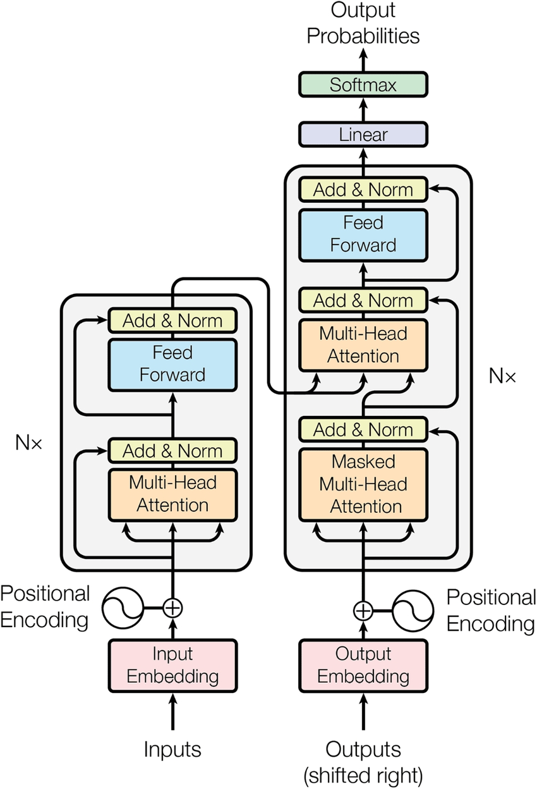

# Transformer from Scratch: Sequence-to-Sequence Model



*Architecture diagram inspired by the original Transformer model from [Vaswani et al., “Attention Is All You Need” (2017)](https://arxiv.org/abs/1706.03762).*

## Table of Contents
- [Project Overview](#project-overview)
- [Installation](#installation)
- [Dataset Preparation](#dataset-preparation)
- [Training](#training)
- [Testing / Evaluation](#testing--evaluation)
- [Project Structure](#project-structure)
- [References](#references)

---

## Project Overview

This project implements a **Transformer-based sequence-to-sequence model** from scratch, demonstrating core techniques in modern **Natural Language Processing (NLP)**, including:

- Multi-head attention
- Encoder-decoder architecture
- Word-level and subword-level (BPE) tokenization
- Rotary Positional Embeddings (RoPE)
- Autoregressive sequence generation

The model can be trained on **any sequence-to-sequence dataset**, such as language translation, summarization, or other NLP tasks. In examples, it was trained on Czech-to-English sentence pairs, but the architecture is fully general-purpose.

The model is trained using *cross-entropy* loss with padded sequences and evaluated with **BLEU-N** metric.


**Example:**

| Input Sequence   | Predicted Output | Reference Output |
|-----------------|-----------------|----------------|
| `Chci koupit nové jídlo.` | `I want to buy food .` | `I want to buy new food.` |

---


## Installation

**Requirements:**

- Python 3.8+
- PyTorch 2.x
- HuggingFace Tokenizers
- Matplotlib

Install dependencies:

```bash
pip install -r requirements.txt
```


## Dataset Preparation

The project expects data in tab-separated format, with source and target sequences:
```
<target sequence> \t <source sequence>
```

Example `test_basic.txt`:
```
I see a new car.                	Vidím nové auto.
I see a small city.              	Vidím malé město.
I do not see the old library.    	Nevidím starou knihovnu.
```

**Split your dataset**

Using `split_dataset.py` you can split the file with pairs of sentences into `train.txt` and `test.txt`:
```
python split_dataset.py \
    --data_path data/raw.txt \
    --unshuffled \
    --range_train 0:1000 \
    --range_test 1000:1200 \
    --output_dir data/
```

## Training
Train the seq2seq Transformer using `train.py`:
```
python train.py \
    --data_path data/train.txt \
    --tokenizer BPE \
    --max_vocab_size 5000 \
    --d_model 64 \
    --num_heads 4 \
    --num_layers 6 \
    --d_ff 128 \
    --dropout 0.1 \
    --epochs 20 \
    --lr 0.001 \
    --checkpoint_dir runs/
```

**Outputs**:

Model checkpoints, training loss plot and tokenizer states (`BPE` or `WORD` level) are saved in `runs/checkpoint_<timestamp>/`

## Testing / Evaluation
Evaluate a trained model on a test set:
```
python test.py \
    --data_path data/test.txt \
    --checkpoint_dir runs/checkpoint_20251120_123015 \
    --max_tgt_len 20
```

**Features**:

- Automatic source encoding with the stored tokenizer
- Autoregressive decoding using <SOS> and <EOS> tokens
- BLEU-1 and BLEU-2 computation
- Prints predictions alongside references

**Example output**:

```
SRC:  Chci koupit nové jídlo.
PRED: I want to buy food .
REF:  I want to buy new food.
BLEU-1: 0.819, BLEU-2: 0.709
```


## Project Structure

**Key modules**:

- `transformer.py` : Transformer encoder-decoder block and layer implementation
- `tokenizer.py` : Word-level and BPE tokenizer with save/load functions
- `dataset_utils.py` : Parsing and preprocessing datasets
- `utils.py` : Saving/loading model and tokenizer states, BLEU metric and helper functions


## References

- [*Vaswani et al., Attention Is All You Need (2017)*](https://arxiv.org/abs/1706.03762)
 — Original Transformer paper introducing multi-head attention.

- [*PyTorch*](https://pytorch.org/docs/stable/index.html) Documentation

- [*HuggingFace Tokenizers*](https://huggingface.co/docs/tokenizers/python/latest/) Documentation

- [*Su et al., RoFormer: Enhanced Transformer with Rotary Position Embedding (2021)*](https://arxiv.org/abs/2104.09864)
 — Rotary positional embeddings (RoPE) used for improved sequence modeling.

- [ManyThings.org: Tab-delimited Bilingual Sentence Pairs](https://www.manythings.org/anki/)  
  — Selected sentence pairs from the Tatoeba Project. Used for sequence-to-sequence training examples.
